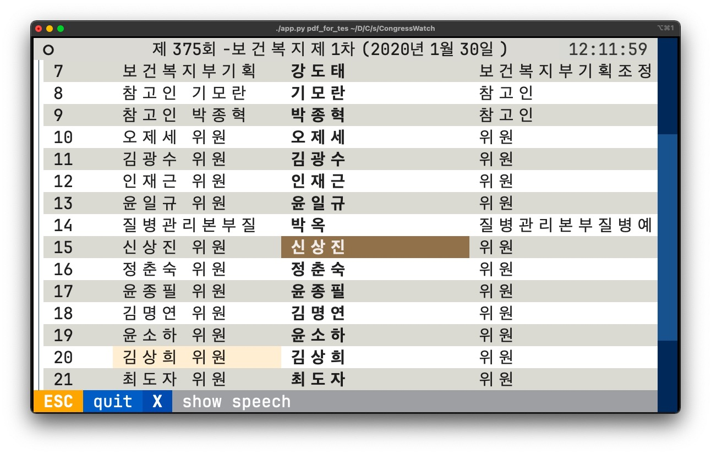

# CongressWatch🇰🇷

- [한국어](./KR_README.md)
- [中文](./ZH_README.md)

A data analysis tool primarily used for parsing Korean Congressional meeting record files (PDF files), **which might assist in your 🏫political science papers✏️⌨️**, provided that you are not intimidated by the use of terminal command lines💻 and Python🐍.

---



- [Usage](https://github.com/anzhi0708/CongressWatchKR#usage)
- [Notice](https://github.com/anzhi0708/CongressWatchKR#note)

This library was designed to complete my graduation thesis🎓, including modules for web scraping, text analysis, and more. Since it was designed for personal use, it has not been published on PyPi.

Specifically, it uses the `PyMuPDF` library to extract text content from PDF files, and then filters the content using **regular expressions**, converting a PDF file into a plain Python `dict`(`dict[str, list[str]]`), storing it in the format of `{"person name": ["speech content line #1", "speech content line #2"...]}` for further analysis🔍.

The design is not complicated and can be easily replicated in other languages. Humbly speaking, the main contribution of this library is the author's physical labor, integrating tedious details together for convenient future use. From a computer science perspective, its design doesn't have any standout features.🤷‍♂️

To perform decade-spanning analyses, I conducted a simple analysis and reverse engineering of the KR Assembly website, implementing a web scraping module for downloading meeting records within a specified range.

This web crawler heavily depends on the API design of the Congressional website. If the API of the Congressional website changes, the crawling function will be affected. Additionally, when using its crawling function to download PDF meeting records, you may want to limit the frequency of the crawler's operations, such as scraping a small number of PDF files per second. This could potentially alleviate the server pressure on the Congressional website and prevent your own IP from being banned due to high-frequency access.

## Usage

```bash
cd src/CongressWatch/
```


`main.py` is everything you need.

```bash
# Show all options / commands
python3 main.py

# 'main.py comm':
# This command takes in the name of a committee and then plots the historical changes in the proportion of female parliamentarians' speeches in meetings of that committee.
python3 main.py comm '환노위'

# Other commands
# 'main.py detail':
python3 main.py detail YEAR TOP_N

# 'main.py plotfreq':
python3 main.py plotfreq YEAR

# ... and so on. Run `main.py` without any arguments to see all.

# Also, there're some useful little scripts under this directory:
python3 _get_percentage_by_comm.py get 20
```

- TUI Mode

This is a TUI interface based on the textual library, supporting both mouse and keyboard operations. As textual is still in the early stages of development, if the UI interface fails to function due to changes in its API, please try downgrading textual, install earlier versions of textual (prior to 0.10), or cease using the UI interface and use the command line interface instead.

```bash
python3 app.py PDF_FILE

# Example:
python3 app.py pdf_for_testing/sample_2020.pdf
```


- With Python
```python
>>> import CongressWatch as cw
>>> cw.period("2019-01-01", "2019-03-01")
<'period' object, with 10 conferences from 2019-01-01 to 2019-03-01, at 0x10f159900>
>>> for conf in cw.period("2019-01-01", "2019-03-01"): print(conf)
...
Conference(2019-01-09, 14:05, 수, 제365회 국회(임시회) 제04차 남북경제협력특별위원회, 2 movie(s))
Conference(2019-01-01, 00:15, 화, 제365회 국회(임시회) 제02차 국회운영위원회, 1 movie(s))
Conference(2019-01-16, 09:36, 수, 제365회 국회(임시회) 폐회중 제01차 과학기술정보방송통신위원회, 1 movie(s))
Conference(2019-01-15, 10:16, 화, 제365회 국회(임시회) 제01차 국방위원회, 1 movie(s))
Conference(2019-01-09, 10:24, 수, 제365회 국회(임시회) 제02차 행정안전위원회, 1 movie(s))
Conference(2019-01-09, 11:05, 수, 제365회 국회(임시회) 제01차 보건복지위원회, 1 movie(s))
Conference(2019-01-18, 10:03, 금, 제365회 국회(임시회) 폐회중 제02차 보건복지위원회, 2 movie(s))
Conference(2019-01-22, 14:28, 화, 제366회 국회(임시회) 제01차 문화체육관광위원회, 1 movie(s))
Conference(2019-01-21, 14:38, 월, 제366회 국회(임시회) 제01차 행정안전위원회, 1 movie(s))
Conference(2019-01-24, 10:07, 목, 제366회 국회(임시회) 제08차 정치개혁특별위원회, 1 movie(s))
```

Downloading PDF files

```python

>>> # The download function uses Python's file operation functions to write to local storage in binary format. This is a relatively primitive API, which might not be very friendly to computer novices.
>>> import CongressWatch as cw
>>> for conf in cw.period("2019-01-01", "2019-03-01"):
...     file = f"{conf.date}_{conf.ct1}.{conf.ct2}.{conf.ct3}.{conf.mc}.pdf"
...     with open(f"./{file}", 'wb') as out:
...             out.write(conf.pdf)
...

# These numbers represent the disk space taken up by the PDF files you've downloaded. You can just ignore them.

1760256
498688
1280000
486400
494592
1103872
1641472
412672
475136
714752

# The mysterious codes:
# `ct1`, `ct2`, etc., are part of the Congressional website's API, 
# and they are used to locate a specific PDF file.
# The website's API design includes abbreviations 
# in Korean romanized letters and English, 
# neither of which are my native language. 
#
# As a result, I gave up trying to decipher these abbreviations and obediently use what they provide. 
# If you want to use this download function, 
# I suggest you simply copy this code — of course, changing the date range to the one you need.
```
```bash
# After the download is complete, 
# you will see PDF file names like these in your directory:

2019-01-01_20.365.02.324.pdf  2019-01-18_20.365.02.333.pdf
2019-01-09_20.365.01.333.pdf  2019-01-21_20.366.01.345.pdf
2019-01-09_20.365.02.345.pdf  2019-01-22_20.366.01.359.pdf
2019-01-09_20.365.04.4GT.pdf  2019-01-24_20.366.08.4AL.pdf
2019-01-15_20.365.01.337.pdf  CongressWatch/
2019-01-16_20.365.01.356.pdf
```

Getting the MP list of a specific period

```python
>>> import CongressWatch as cw
>>> cw.Assembly(19).has("문재인")
True
>>> cw.Assembly(20).has("박근혜")
False

```

`PDFText` is a wrapper class based on the `PyMuPDF` module. It can parse a 국회회의록 PDF file into a **Python dictionary** in the form of `{MP_NAME: LIST_OF_LINES_OF_HIS_OR_HER_SPEECH}`. For more information, use the built-in function `help`.

```python
>>> cw.PDFText
<class 'ajpdf.PDFText'>
```

`Conferences(N)` is a collection of conferences for the nth assembly. `Conferences` contain elements of `Conference`s.

```python
>>> for conf in cw.Conferences(15):
...     print(conf)
...     print(conf.movies)
...     break
...
Conference(1999-12-28, 12:00, 화, 제209회 국회(임시회) 제01차 본회의, 1 movie(s))
[Movie(41 speak(s))]
```

`Movie` objects

```python
for conf in cw.Conferences(10):
...     for movie in conf:
...             for speak in movie:
...                     print(speak)
...     break
...
Speak(real_time=None, play_time='00:05:58', speak_type='보고', no=106739, speak_title='구범모의원', wv=0)
Speak(real_time=None, play_time='00:02:15', speak_type='인사', no=106740, speak_title='부총리겸경제기획원장관', wv=0)
Speak(real_time=None, play_time='00:04:31', speak_type='기타', no=106741, speak_title='위원장', wv=0)

```

`Movie` objects and `Speak` objects come from the metadata of meeting video records (video files). In this library, we are not concerned with the video records of a meeting, but by obtaining this metadata, we can use it as an index for searching meetings. Through this information, we can know which members spoke in a particular meeting, as well as their speaking time, type of speech, and other information. By using these objects, we don't need to obtain the video files, as they occupy too much disk space, take longer to download, and require more powerful hardware capabilities for computer vision analysis; we simply use them as indices.

## Note

Due to being designed for personal use, this program has only been tested on the author's computer🍎, and some configuration information, such as the font settings for the graphics module, is hard-coded into the source file. However, it is not difficult to modify — as long as you have a basic understanding of Python, you can modify these configuration settings.

Regarding further updates to this library, I will only conduct necessary bug fixes as conditions allow, and won't add any new functions. If you are a proficient Python user, you should be able to see the simple design of this library and easily modify or extend it with the help of some auxiliary stuff ;-). If you are a Python beginner and encounter problems when using this library, you can try to contact me. However, due to potential changes in the network conditions of my region, I can't guarantee a timely response.

I anticipate that this library could offer a bit of help to future studies in Korean politics🇰🇷. Therefore, this `README` file is prepared for those who plan to use this library for writing their papers, especially for my seniors and juniors in the political science department. I also recognize that some AI experts might want to use it to gather relevant training data for NLP🤖️. When using it, please be mindful of the terms set by the Korean Congressional website that prohibit the use of data for commercial purposes💰, as well as the terms of third-party libraries used in this library. CongressWatch uses many third-party libraries, some of which may also limit commercial use.

This library was developed while simultaneously being tested and used. If you see some hard-to-understand file names or cryptic screenshots, they are byproducts from the development process. You just need to use the library following the example code, and make the necessary code modifications when errors occur (I guess most issues are related to the configuration files, as they have been hard-coded into the source code to facilitate my paper writing).

This library has many areas that should be improved. For example, it should use SQL databases to store the information obtained, instead of storing it in pickle, JSON, or CSV formats and keeping it in memory as Python objects for analysis. This is due to the lack of consideration in the initial design and the author's lack of engineering experience.
